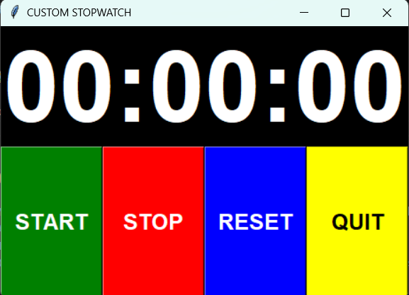

# ⏱️ Tkinter GUI Stopwatch

A simple, lightweight stopwatch built with Python and Tkinter. No browser tabs needed — just a clean, always-on-top timer for your desktop.

---

## 🖼️ Preview



---

## ✨ Why Use This?

- **No browser clutter** — Track time without opening another tab
- **Always visible** — Keep it anywhere on your screen while you work
- **Lightweight** — Runs instantly, no installation bloat
- **Color-coded controls** — Green (Start), Red (Stop), Blue (Reset), Yellow (Quit)

---

## 🚀 How to Run

```bash
# Clone the repo
git clone https://github.com/Anubhav990/tkinter-gui-stopwatch.git

# Navigate to folder
cd tkinter-gui-stopwatch

# Run it
python stopwatch.py